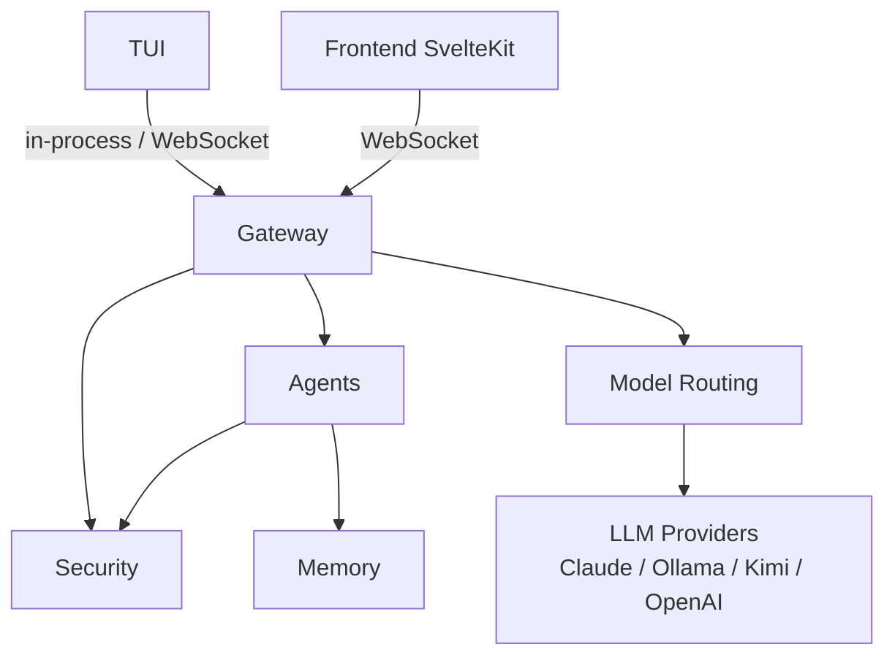

# Corvus Architecture

Local-first, self-hosted multi-agent gateway. Single Python process routing chat into domain-specific agents.

## Subsystems

| Subsystem | Purpose | Ground Truth |
|-----------|---------|--------------|
| Gateway | Central runtime: routing, sessions, WebSocket, agent dispatch | [docs/ground-truth/gateway/](docs/ground-truth/gateway/) |
| Security | Policy engine, auth, audit, rate limiting, sanitization | [docs/ground-truth/security/](docs/ground-truth/security/) |
| Agents | 10 agents (1 router + 8 domain + 1 general), prompt composition, isolation | [docs/ground-truth/agents/](docs/ground-truth/agents/) |
| Memory | FTS5 + Cognee recall, Obsidian vault storage | [docs/ground-truth/memory/](docs/ground-truth/memory/) |
| Model Routing | LiteLLM proxy, multi-backend dispatch with fallbacks | [docs/ground-truth/model-routing/](docs/ground-truth/model-routing/) |
| TUI | Terminal interface (Rich + prompt_toolkit) | [docs/ground-truth/tui/](docs/ground-truth/tui/) |

For details, see the linked ground truth files.
