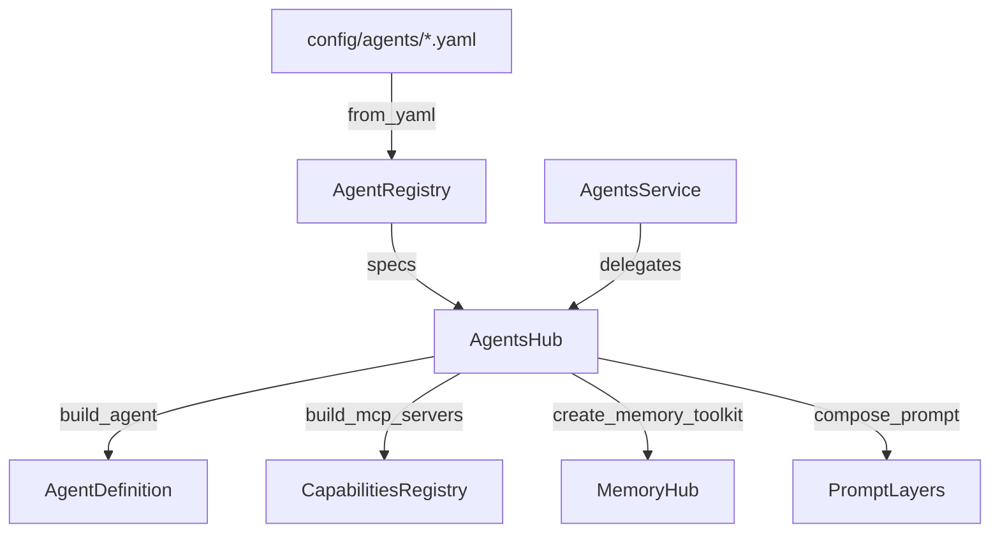

# Agent System Overview

Corvus has 10 agents defined as YAML specs under `config/agents/`: huginn (router), general, work, personal, finance, homelab, home, docs, email, and music. AgentRegistry loads and validates specs from disk, AgentsHub wires specs into SDK AgentDefinitions with tools, memory, and composed prompts. AgentsService provides the transport-agnostic API layer for frontend and TUI consumers.

## Ground Truths

- AgentSpec is a plain dataclass with nested AgentModelConfig, AgentToolConfig, and optional AgentMemoryConfig; loaded via `from_yaml()` or `from_dict()`.
- AgentRegistry supports two YAML layouts: flat (`config/agents/<name>.yaml`) and directory-based (`config/agents/<name>/agent.yaml` with optional `soul.md`, `prompt.md`).
- Registry provides full CRUD: `load()`, `get()`, `list_enabled()`, `list_all()`, `create()`, `update()` (deep merge), `deactivate()`, `reload()` (diff-based hot reload).
- AgentsHub.build_agent() creates an SDK `AgentDefinition` with description, composed prompt, builtin tools, and resolved SDK model name.
- AgentsHub.build_mcp_servers() resolves capability modules via CapabilitiesRegistry (skipping hub-managed modules like "memory") and adds a per-agent memory MCP server.
- Model resolution is config-driven via ModelRouter; `_resolve_sdk_model()` returns a valid SDK model literal or None for non-native backends.
- `build_all()` returns a `BuildResult` with agents dict and errors dict; partial failures produce degraded-mode operation.
- Complexity field on each agent spec is one of "high", "medium", "low" and drives model routing.
- Confirm-gated tools are derived from YAML specs and expanded from short dotted names to full MCP tool name format.
- AgentsHub rewires MemoryHub resolvers at init via `set_resolvers()` for spec-based domain access lookups.

## Boundaries

- **Depends on:** `claude_agent_sdk`, `corvus.memory.MemoryHub`, `corvus.capabilities.registry.CapabilitiesRegistry`, `corvus.model_router.ModelRouter`
- **Consumed by:** `corvus.gateway` (server startup, session routing), `corvus.agents.service.AgentsService`, `corvus.tui` (via GatewayProtocol)
- **Does NOT:** run agent sessions directly, handle WebSocket transport, or manage tool execution sandboxing

## Structure

