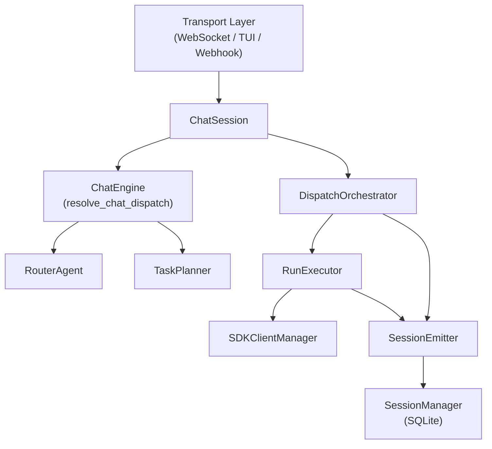

# Gateway Overview

The Corvus gateway is the central runtime orchestrating chat sessions, agent dispatch, model routing, and event persistence. It is a Python package (`corvus/gateway/`) composed of focused modules extracted from a former monolithic `ChatSession` class. The gateway is instantiated at startup via `build_runtime()` in `corvus/gateway/runtime.py` and exposed through a FastAPI composition root in `corvus/server.py`. It connects user-facing transports (WebSocket, TUI in-process, webhooks/scheduler) to domain-specific agents through a planner-driven dispatch pipeline.

## Ground Truths

- `GatewayRuntime` is a `@dataclass(slots=True)` holding all long-lived components: `EventEmitter`, `ModelRouter`, `LiteLLMManager`, `AgentRegistry`, `CapabilitiesRegistry`, `MemoryHub`, `AgentsHub`, `RouterAgent`, `SessionManager`, `CronScheduler`, `AgentSupervisor`, `TaskPlanner`, `TraceHub`, `DispatchControlRegistry`, `BreakGlassSessionRegistry`, `AcpAgentRegistry`, and `active_connections`.
- `build_runtime()` constructs all dependencies, validates startup readiness, and returns a single `GatewayRuntime` instance.
- The gateway package contains 19 modules: `chat_session`, `chat_engine`, `run_executor`, `dispatch_orchestrator`, `dispatch_runtime`, `dispatch_metrics`, `session_emitter`, `protocol`, `task_planner`, `options`, `runtime`, `control_plane`, `trace_hub`, `confirm_queue`, `background_dispatch`, `acp_executor`, `workspace_runtime`, `sdk_client_manager`.
- `corvus/server.py` is a thin composition root: it calls `build_runtime()`, registers FastAPI routers, and manages lifespan.
- `SDKClientManager` manages persistent, pooled `ClaudeSDKClient` subprocess connections. Clients are created per `(session_id, agent_name)` pair and reused across turns. Idle eviction runs on a background loop. `_safe_disconnect()` wraps teardown with a 5-second timeout to prevent hangs from `asyncio.CancelledError`.
- `ManagedClient` tracks per-client metrics (tokens, cost, tool calls) and checkpoints. `create_stub()` is a test-only factory for exercising pool logic without real subprocesses.
- Credentials are loaded via SOPS credential store at startup; sanitization patterns are registered for all credential values.
- LiteLLM proxy handles multi-backend model routing (Claude, Ollama, Kimi, OpenAI/Groq) from `config/models.yaml`.
- All modules use `structlog` for structured logging (migrated 2026-03-10). Central config lives in `corvus/logging.py` with per-component level filtering and secret scrubbing.

## Boundaries

- **Depends on:** `corvus/agents/`, `corvus/security/`, `corvus/session_manager.py`, `corvus/model_router.py`, `corvus/router.py`, `corvus/memory/`, `claude_agent_sdk`, `config/` YAML files
- **Consumed by:** `corvus/api/` (REST + WebSocket endpoints), `corvus/tui/` (in-process protocol), `corvus/webhooks.py`, `corvus/scheduler.py`
- **Does NOT:** serve HTTP directly (FastAPI does), enforce security policy (defers to `corvus/security/`), manage frontend state

## Structure

