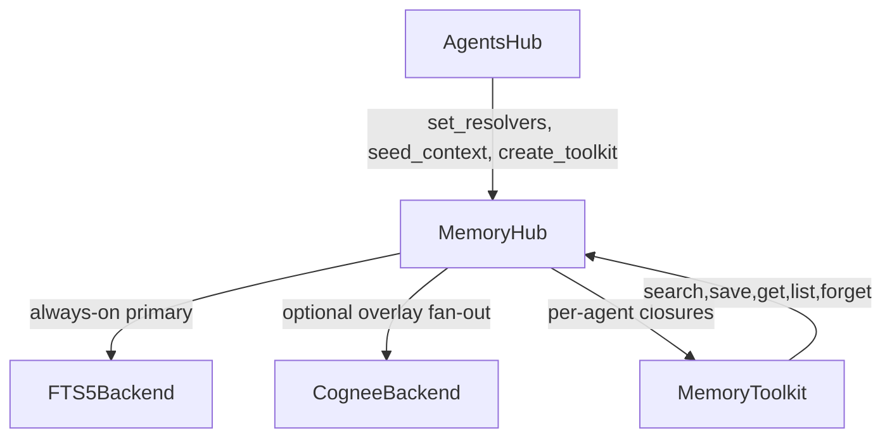

# Memory System Overview

MemoryHub is the central coordinator for the Corvus memory system. It enforces domain ownership on writes, fans out saves to a primary backend plus optional overlays, merges search results across backends, applies exponential temporal decay with evergreen exemption, and writes audit trails. The toolkit factory (`create_memory_toolkit`) produces per-agent tool closures with baked-in identity that agents cannot override.

## Ground Truths

- MemoryHub uses a primary + overlay architecture: FTS5Backend is always-on source of truth; overlays (e.g. CogneeBackend) are optional and best-effort.
- Write enforcement: agents can only write to their `own_domain` or `"shared"`; unknown agents default to read-only shared access.
- Overlay writes are fan-out best-effort with consecutive failure tracking per overlay instance.
- Temporal decay is exponential with configurable `decay_half_life_days` (default 30); records with `importance >= evergreen_threshold` (default 0.9) are exempt.
- `seed_context()` is synchronous for prompt composition; fetches up to `limit * 2` records, applies decay, sorts evergreen-first then by score.
- `create_memory_toolkit()` returns 5 MemoryTool objects (search, save, get, list, forget) with `agent_name` captured in closures.
- MemoryConfig loads from YAML via `from_file()` with safe fallback to defaults; primary DB defaults to `.data/memory/main.sqlite`.
- MemoryRecord visibility is constrained to `"private"` or `"shared"` via `__post_init__` validation.
- `set_resolvers()` supports two-phase init: AgentsHub rewires MemoryHub resolvers from safe defaults to spec-based lookups after registry load.
- Merge deduplicates by record ID, keeping the highest score per ID across primary and overlays.

## Boundaries

- **Depends on:** `corvus.memory.backends.fts5`, `corvus.memory.backends.cognee`, `corvus.memory.config`, `corvus.memory.record`
- **Consumed by:** `corvus.agents.hub.AgentsHub` (prompt seeding, toolkit creation, resolver wiring), `corvus.tui` (via GatewayProtocol memory operations)
- **Does NOT:** embed vectors, run MMR diversity re-ranking (deferred TODO), or handle cross-domain writes

## Structure

