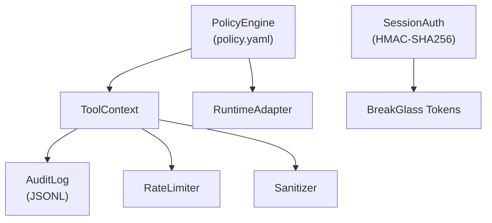

# Security Architecture Overview

The `corvus/security/` package implements Corvus's defense-in-depth security layer. It provides a three-tier permission model, append-only audit logging, per-tool per-session rate limiting, credential pattern sanitization, HMAC-SHA256 session and break-glass tokens, runtime context injection for tool handlers, and a runtime adapter abstraction for CLI portability. All security logic is runtime-agnostic; CLI-specific concerns are isolated behind the `RuntimeAdapter` protocol.

## Ground Truths

- The package contains 11 modules: `policy.py`, `audit.py`, `rate_limiter.py`, `sanitizer.py`, `session_auth.py`, `tokens.py`, `tool_context.py`, `mcp_tool.py`, `tool_catalog.py`, `session_lifecycle.py`, `session_timeout.py`, `runtime_adapter.py`
- Double enforcement: PolicyEngine enforces deny lists at the Corvus layer; `RuntimeAdapter` composes `permissions.deny` for the CLI layer as defense-in-depth
- Deny-wins-over-allow is the core invariant: global deny list always applies, merged with per-agent extra deny
- Every tool call receives a `ToolContext` with pre-resolved credentials, permission tier, and session metadata
- Tools declare credential dependencies via `MCPToolDef.requires_credentials`; only declared credentials are injected
- Tool results are sanitized by `sanitizer.py` before entering agent context (JWTs, API keys, connection strings, auth headers, hex tokens)
- Break-glass tokens are HMAC-SHA256, session-bound, with configurable TTL (default 1h, max 4h)
- WebSocket auth uses HMAC-SHA256 session tokens; localhost auto-auth is eliminated
- Session idle timeout (default 30min) can auto-deactivate break-glass

## Boundaries

- **Depends on:** `config/policy.yaml`, `corvus/credential_store.py`
- **Consumed by:** `corvus/gateway/` (run_executor, chat_session), `corvus/agents/hub.py`
- **Does NOT:** handle agent dispatch, manage sessions, or serve HTTP

## Structure

