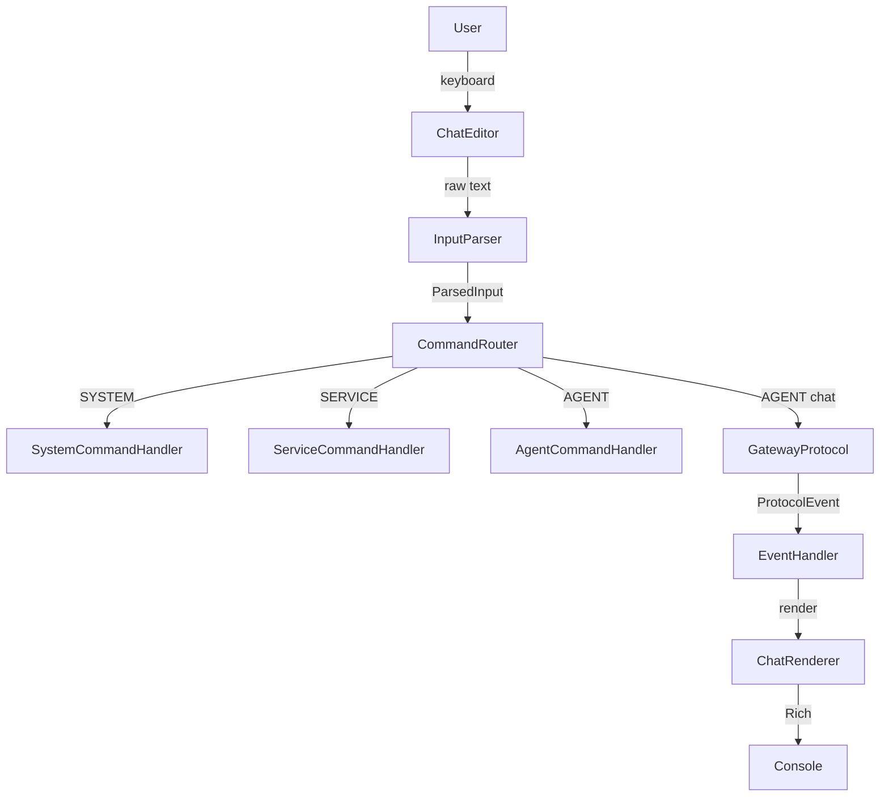

# TUI Overview

The Corvus TUI is a terminal chat interface built on Rich (rendering) and prompt_toolkit (input/completion). TuiApp is the central coordinator that wires together the theme, console, renderer, agent stack, command registry, command router, input parser, event handler, gateway protocol, token counter, completer, session manager, split manager, and editor. It supports two gateway modes: InProcessGateway and WebSocketGateway.

## Ground Truths

- TuiApp creates all components in `__init__()` and registers built-in slash commands across three tiers (SYSTEM, SERVICE, AGENT).
- GatewayProtocol is an abstract base class defining transport-agnostic operations: connect, disconnect, send_message, respond_confirm, cancel_run, list_sessions, resume_session, list_agents, list_models, memory CRUD, and list_agent_tools.
- Two protocol implementations: InProcessGateway (default, in-process) and WebSocketGateway (connects to `ws://localhost:8000/ws` with session token auth).
- ProtocolEvent hierarchy: 13 typed dataclass events (DispatchStart/Plan/Complete, RunStart/Phase/OutputChunk/Complete, ToolStart/Result, ConfirmRequest/Response, RateLimitEvent, ErrorEvent) plus base ProtocolEvent fallback.
- `parse_event()` maps raw WebSocket JSON dicts to typed events with field alias normalization.
- Main loop: connect gateway, load agents, read input via ChatEditor, classify via CommandRouter, dispatch to handler tier, handle pending confirmations with y/n/a responses.
- EventHandler processes streaming events; supports auto-approve via `set_auto_approve()` for always-allowed tools.
- Entry point: `python -m corvus.tui` with `--mode` (inprocess/websocket), `--url`, `--token` arguments.
- Prompt displays agent breadcrumb path from AgentStack; status bar shows token count and permission tier.

## Boundaries

- **Depends on:** `rich`, `prompt_toolkit`, `corvus.security.audit`, `corvus.security.policy`, `corvus.tui.protocol`
- **Consumed by:** End users via terminal
- **Does NOT:** run agent sessions directly, manage the gateway server, or handle backend model routing

## Structure

